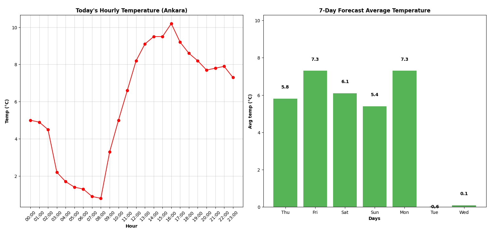

### Weather Analysis Dashboard ###

This project is a Python-based tool that provides detailed weather analysis and data visualization for a specific city. It utilizes the **OpenWeatherMap API** to fetch real-time and forecast data, which is then visualized using **Matplotlib**.

# Project Visuals

Below are the hourly and weekly temperature analysis charts generated by the application:



# Features
- **API Integration:** Fetches real-time current weather and a 7-day forecast.
- **Data Analysis:** Calculates daily average temperatures and "feels-like" metrics.
- **Visualization:**
  - 📈 **Hourly:** Line chart showing temperature trends for the current day.
  - 📊 **Weekly:** Bar chart displaying the 7-day average temperature forecast.
- **CLI Interface:** User-friendly command-line interaction.

# Tech Stack
- **Python 3.x**
- **Matplotlib** (Data Visualization)
- **Requests** (API Calls)
- **Python-Dotenv** (Environment Variable Management)

# Roadmap
- [ ] Migrate from CLI to a **Web GUI** (using Django or Flask).
- [ ] Implement database support (SQL) for historical data storage.
- [ ] Add more advanced statistical analysis features.

# Installation & Usage

1. **Clone the repository:**
   ```bash
   git clone [https://github.com/irmakoznrgz/weather_dashboard.git](https://github.com/irmakoznrgz/weather_dashboard.git)